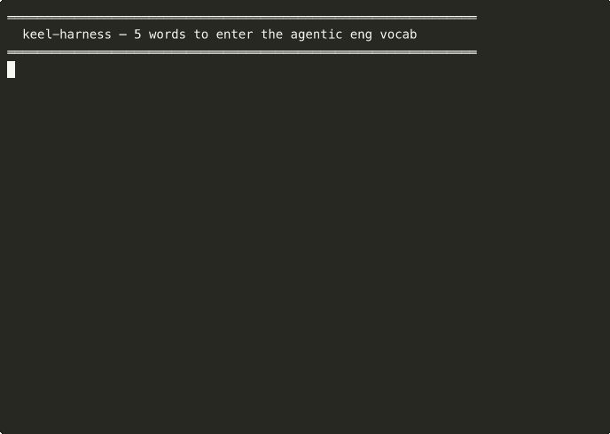
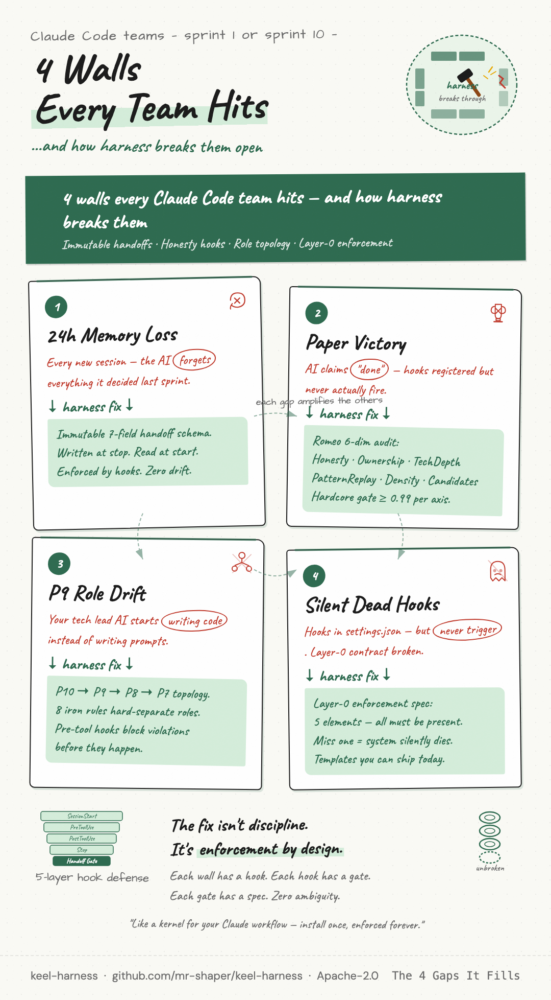
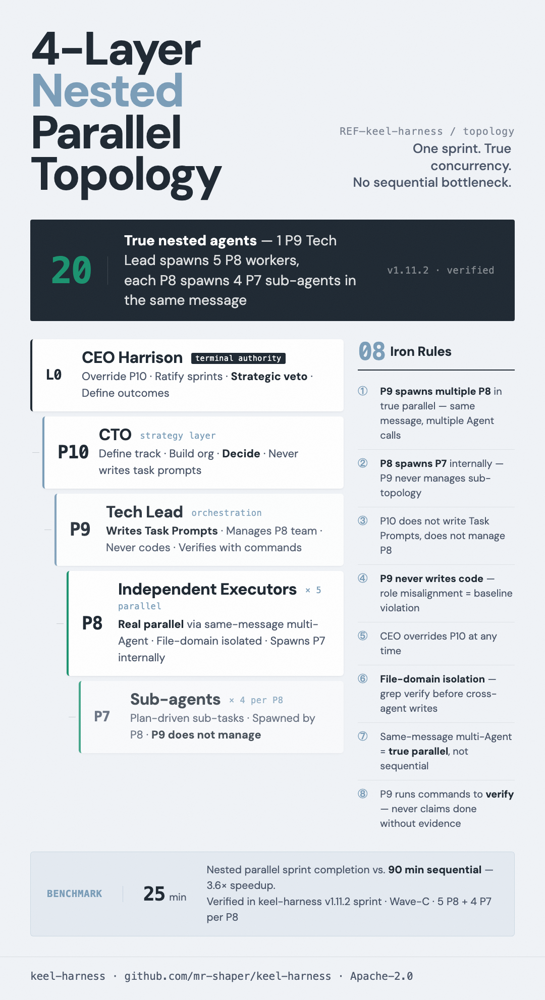

# keel-harness

**24-hour Claude Code sessions that don't drift, forget, or fake-pass tests.**

[](https://github.com/mr-shaper/keel-harness/actions/workflows/tests.yml)
[](https://github.com/mr-shaper/keel-harness/releases)
[](LICENSE)
· **🇺🇸 English** · [🇨🇳 中文](README.zh-CN.md)

[Quickstart](#quickstart-5-min) · [What's Inside](#whats-inside-kernel-scope) · [Architecture](#architecture-4-layer-nested-parallel-topology) · [Docs](#documentation)



> **Without keel:** new session, blank slate. The agent forgets last sprint, re-decides settled questions, commits a stray API key, and tells you the tests pass without running them.
>
> **With keel:** new session, same momentum. 9 hooks fire on every tool call. A 7-field handoff carries context across the restart. Secrets get blocked at commit time. *"Done"* requires the command output to prove it.

```bash
# After installing superpowers + PUA (see Required Dependencies below):
git clone https://github.com/mr-shaper/keel-harness && cd keel-harness && bash install.sh
```

A hook framework + handoff schema + audit gate. Apache-2.0. macOS + Linux. Built on top of [superpowers](https://github.com/obra/superpowers) and [PUA](https://github.com/tanweai/pua).

---

## 30-Second Elevator Pitch

Stop your AI from getting dumber over a 24h session. harness-engineering is the infrastructure
layer that makes Karpathy's agentic engineering enforceable in Claude Code — through immutable
handoffs, Romeo 6-dim audit, canonical honesty hooks, and P10-9-8-7 nested parallel agent
topology. Apache-2.0. macOS + Linux.

---

## The 4 Gaps It Fills



Most teams hit these walls within weeks of using Claude Code for serious engineering:

- **Gap 1 — 24h session memory loss**: Every new session, the AI forgets what it decided last
  sprint. harness fixes this with an immutable 7-field handoff schema — written at session stop,
  read at session start, enforced by hooks. Zero context drift.

- **Gap 2 — Paper victory (Romeo audit blind spots)**: AI claims "done" when hooks are registered
  but never fire. The Romeo 6-dimensional audit framework (Honesty / Ownership / TechDepth /
  PatternReplay / Density / Candidates) enforces a hardcore ≥0.99 bar across 6 independent
  dimensions — not a single-axis pass/fail.

- **Gap 3 — P9 role drift**: Your tech lead AI starts writing code instead of writing prompts.
  The P10-9-8-7 topology with 8 iron rules hard-separates strategy (P10), task-prompt writing
  (P9), implementation (P8), and sub-tasks (P7) — and enforces it via pre-tool hooks that block
  role violations before they happen.

- **Gap 4 — Silent dead hooks**: Hooks appear registered in settings.json but never trigger
  because the Layer 0 contract (CLAUDE.md + settings.json) is incomplete or inconsistent. harness
  ships a Layer 0 enforcement spec — 5 elements that must all be present or the system silently
  dies — plus templates you can fill in and ship.

---

## Required Dependencies (install BEFORE running install.sh)

keel-harness is the **kernel + workflow MDs**. The runtime protocols its
workflow MDs reference live in two upstream OSS plugins. Both are MIT-licensed
and Apache-2.0 compatible. **harness will not function without these.**

`install.sh` Phase 0.5 detects both and ABORTS if either is missing.

### 1. superpowers (MIT, Jesse Vincent / @obra)

Provides: `writing-plans`, `dispatching-parallel-agents`, `test-driven-development`,
`verification-before-completion`, `brainstorming`, `executing-plans`,
`subagent-driven-development`.

```bash
claude plugin marketplace add obra/superpowers-marketplace
claude plugin install superpowers@superpowers-marketplace
```

Repo: https://github.com/obra/superpowers · License: MIT · Version tested: 5.0.7

### 2. PUA (MIT, TanWei Security Lab / @tanweai)

Provides: P10/P9/P8/P7 role protocols, red-line enforcement, Romeo evaluator,
parallel agent topology, performance pressure escalation.

```bash
git clone https://github.com/tanweai/pua ~/.claude/plugins/pua
```

Repo: https://github.com/tanweai/pua · License: MIT · Version tested: 3.0.0

### Verification

```bash
ls ~/.claude/plugins/pua/plugin.json   # PUA installed
ls -d ~/.claude/plugins/cache/superpowers-marketplace 2>/dev/null \
  || ls -d ~/.claude/plugins/marketplaces/superpowers-marketplace
```

If either path is missing, `bash install.sh` will exit 2 with install
instructions printed inline. Use `--skip-deps-check` ONLY for
development/dogfood.

---

## Bundled Plugins (auto-installed by install.sh)

These ship inside `plugins/` and get copied to `~/.claude/plugins/<name>/`
during Phase 1.5. No separate download.

| Plugin | License | What it provides |
|---|---|---|
| **OODC** v1.4.0 | Apache-2.0 (by mr-shaper) | Cognitive loop: Observe → Orient → Decide → Create. 4 reference protocols. Used by `workflows/oodc-superpower-harness-orchestration.md` |
| **compound-selfcheck** v0.1.0 | Apache-2.0 (by mr-shaper) | PostToolUse soft-prompt: when a Write/Edit produces > 100 LOC or > 5KB, emits a stderr reminder to ingest the change into a knowledge base (Compound Engineering, not one-shot). Audit-logs `[COMPOUND-CHECK]` entries to `.harness/hook-trace.log` for "real-trigger vs performance" detection. Soft-prompt only — never blocks. |

---

## Quickstart (5 min)

> **Prerequisites**: superpowers + PUA installed (see Required Dependencies above).

```bash
curl -fsSL https://raw.githubusercontent.com/mr-shaper/keel-harness/main/install.sh | bash
```

Until you have the one-liner cached, manual bootstrap:

```bash
# Step 1: Clone the kernel
git clone https://github.com/mr-shaper/keel-harness.git ~/.claude/plugins/keel-harness-mp

# Step 2: Apply Layer 0 contract templates
cp ~/.claude/plugins/keel-harness-mp/templates/CLAUDE.md.global.template ~/.claude/CLAUDE.md
# Edit ~/.claude/CLAUDE.md — fill in the <PLACEHOLDER> fields for your context

# Step 3: Merge hooks into settings.json (requires jq)
jq -s '.[0] * .[1]' \
  ~/.claude/settings.json \
  ~/.claude/plugins/keel-harness-mp/templates/settings.json.template \
  > /tmp/settings-merged.json && mv /tmp/settings-merged.json ~/.claude/settings.json
# Restart Claude Code — harness hooks are now active
```

After install, start your first harnessed session:

```
1. Read .harness/handoff-S<N-1>-to-S<N>.md   — previous session's authoritative next_action
2. Answer 5 self-checks (Q1 project / Q2 next_action / Q3 clarity / Q4 handoff name / Q5 week)
3. Work — Stop hook writes the next handoff automatically
```

### Standard Plan-Authoring Prompt (copy-paste this for any non-trivial task)

When you give the agent a task that has 3+ steps, multi-file changes, or
crosses module boundaries, paste this prompt verbatim. It binds the agent
to the harness execution contract and prevents the most common failure
mode (skipping workflow reads, which causes the UserPromptSubmit hook to
emit warnings mid-conversation).

```text
For this task, design and execute the plan under the four-layer nested
parallel topology of harness:

  Harness  ⊃  OODC  ⊃  PUA P10-9-8-7  ⊃  Superpower Pipeline

The plan itself must read as a guide that future executing agents follow
under the same topology — annotate each Wave / Phase with which layer
drives it (which OODC step, which role tier, which Pipeline phase).

Before drafting the plan, READ these five workflow MDs (skipping them
triggers a UserPromptSubmit warning that interrupts the conversation):

  1. workflows/pua-topology.md
  2. workflows/oodc-superpower-harness-orchestration.md
  3. workflows/superpower-pipeline.md
  4. workflows/skill-loading-sop.md
  5. workflows/kb-ingestion-sop.md

Then verify any Skill you intend to invoke is REALLY loaded
(skill-loading-sop §5 — five dimensions: tool-call, references body Read,
protocol applied, sub-agent injection, evidence-aligned self-eval).
A Skill listed in inventory is not the same as a Skill actually loaded.

Wave / Phase tracking is mandatory: every Wave and every Phase in the
plan MUST have a TaskCreate entry. The TaskCreate list IS the Superpower
Pipeline stage tracker — update statuses as you progress
(pending → in_progress → completed). No Wave without a task entry.

Once the plan is drafted with topology annotations, ratification gates,
and TaskCreate entries, present it for approval before execution.
```

The full version of this contract — failure modes, role definitions,
skill verification protocol — lives in
[`docs/agent-execution-standard.md`](docs/agent-execution-standard.md).

For more user-facing prompts (project bootstrap, sprint kickoff, sprint
close, etc.), see [`docs/quickstart-prompts.md`](docs/quickstart-prompts.md).

---

## What's Inside (Kernel Scope)

The kernel is the minimum viable harness — no private configuration, no personal plugins,
no company-specific logic. Everything that ships is universally applicable to any Claude Code
power user.

### Workflow Documentation (5 files)

| File | What it encodes |
|---|---|
| `workflows/pua-topology.md` | P10-9-8-7 nested parallel topology + 8 iron rules |
| `workflows/oodc-superpower-harness-orchestration.md` | OODC loop (Observe → Orient → Decide → Create) orchestration across Harness + Superpower + PUA layers |
| `workflows/superpower-pipeline.md` | Phase 0-4 engineering pipeline (kickoff → parallel explore → decision convergence → dev → close) |
| `workflows/skill-loading-sop.md` | Skill discovery + loading SOP — prevents hallucinated tool calls |
| `workflows/kb-ingestion-sop.md` | Knowledge base ingestion pipeline — Compound Engineering, not one-shot generation |

### Hooks (9 enforce-core hooks)

| Hook | Type | What it enforces |
|---|---|---|
| `stop-handoff-writer.sh` | Stop | Writes 7-field handoff at every session end |
| `pre-tool-handoff-read-gate.sh` | PreToolUse | Blocks file writes until handoff is read (sticky flag) |
| `pre-tool-handoff-semantic-gate.sh` | PreToolUse | Semantic check — prevents writing wrong session's handoff |
| `user-prompt-l42-workflow-trigger-gate.sh` | UserPromptSubmit | Routes trigger words (harness/OODC/PUA/Superpower) to the correct workflow MD |
| `pre-tool-doc-sync-sop-enforce.sh` | PreToolUse | Enforces doc-sync routing before any knowledge base write |
| `post-tool-chmod-ci-gate.sh` | PostToolUse | chmod guard — prevents CI scripts from losing execute bit silently |
| `session-start-layer0-health.sh` | SessionStart | Layer 0 health check — verifies all 5 contract elements are present |
| `pre-tool-plan-quality-gate.sh` | PreToolUse | Blocks low-quality plan writes (Romeo ≥0.99 gate) |

### Templates

- `templates/handoff-template.md` — 7-field handoff schema (sprint / next_action / blockers / decisions / files_changed / self_check / romeo_score)
- `templates/cat-h-rule-template.md` — Category H canonical law template (for adding new ratified rules)
- `templates/CLAUDE.md.global.template` — Generic global Claude Code contract (~180 LOC, scrubbed of personal config)
- `templates/CLAUDE.md.project.template` — Generic project contract (~50 LOC, 5-must-reads + 5-self-checks + bible principles placeholder)
- `templates/settings.json.template` — Generic settings.json with 9 hooks registered (~125 LOC, 8 enforce-core + 1 compound-selfcheck plugin hook)

### Audit Framework

- `audit/romeo-6-dim-framework.md` — Romeo 6-dimensional audit spec (Honesty / Ownership / TechDepth / PatternReplay / Density / Candidates), ≥0.99 hardcore gate, evidence-alignment rules
- `docs/sprint-kickoff-checklist.md` — Five-layer GATE self-check (Layer A entity / B content / C gate / D config / E behavior fire). Mandatory at every sprint kickoff to prevent score inflation

### Tooling

- `sync.sh` — 5-command sync (init / export / import / diff / release) with 5-layer privacy protection
- `scripts/sync-self-check.sh` — Cross-platform 5-layer evidence dump. Read-only by design: maintainer reads the dump and self-evaluates sprint outcome (the script never decides outcome itself — P9-doesn't-decide-L4 pattern)
- `manifest.json` — Kernel file whitelist + private blacklist keywords (what stays in, what never ships)
- `install.sh` — One-line bootstrap (ships W3)
- `CHANGELOG.md` — [Keep a Changelog](https://keepachangelog.com/) format, semver tags
- `LICENSE` — Apache-2.0

---

## Demos (asciinema → agg-rendered GIFs)

Three additional reproducible demos cover the gaps in motion:

| # | Demo | Length | Gap |
|---|---|---|---|
| 1 | [24h Cross-Session Continuity](demo/demo-1.gif) | 3 min | Gap 1 — AI memory loss |
| 2 | [4-Layer Nested Parallel — 7 P8 → 7× speedup](demo/demo-2.gif) | 2 min | Gap 3 — P9 role drift |
| 3 | [Canonical Honesty Hooks — 5-layer defense](demo/demo-3.gif) | 2.5 min | Gap 2 — paper victory |

Reproduce locally: `brew install asciinema agg && bash demo/record.sh all`

---

## Architecture: 4-Layer Nested Parallel Topology



```
═══════════════════════════════════════════════════════════════════
Harness (cross-session, weeks to months)
   │
   └─ OODC (Observe → Orient → Decide → Create, 1 major goal = 1 loop)
        │
        └─ Superpower Pipeline (Phase 0 → 1 → 2 → 3 → 4)
             │   Phase 0  kickoff (load skills + create tasks + manifest draft)
             │   Phase 1  parallel exploration (brainstorm, retro, compete scan)
             │   Phase 2  decision convergence (P10 ratifies, no more options)
             │   Phase 3  development  (N waves of true parallel P8 agents)
             │   Phase 4  close (launch / retrospective / handoff)
             │
     CEO (the human user) — ultimate authority, sits above all AI roles
       │  ratifies / overrides P10 ; final trump card on every strategic decision
       ↓
             └─ PUA P10 / P9 / P8 / P7  (all AI roles)
                  P10  = CTO (AI strategy layer) — ratifies under CEO, dispatches to P9, never writes code
                  P9   = Tech Lead — writes Task Prompts, never writes code
                  P8   = Senior Eng — same-message true parallel, owns a file domain
                  P7   = P8-spawned sub-agent — granular sub-tasks
═══════════════════════════════════════════════════════════════════
```

### The 8 P9 Iron Rules (never violate)

1. P9 dispatches multiple P8s in a single message — true parallel, not sequential
2. P8 spawns P7 internally — P9 never manages P7 directly
3. P10 never writes Task Prompts, never manages P8
4. **P9 never writes code** — writing code = role drift = automatic PUA 3.5 penalty
5. **CEO (the human user) always overrides P10** — CEO is human, P10 is the AI CTO; CEO is the ultimate authority above the entire AI hierarchy
6. File domain isolation — grep-verify no overlap before dispatch
7. Same-message multi-Agent = true parallel (not loop-sequential)
8. P9 runs verification commands and pastes output — no empty claims

---

## The 5 Words We Want in the Agent Engineering Vocabulary

harness-engineering introduces 5 precise concepts that fill gaps in the current agent
engineering lexicon:

| Term | Definition |
|---|---|
| **Thin Watering Principle** | Apply harness constraints as a thin, universal layer — never couple enforcement to private personal config. The harness should work for anyone without modification. |
| **7-Field Handoff Schema** | The minimum viable handoff: `sprint / next_action / blockers / decisions / files_changed / self_check / romeo_score`. Missing any field = the next session is flying blind. |
| **Romeo 6-Dim Audit** | Six independent dimensions — Honesty, Ownership, TechDepth, PatternReplay, Density, Candidates — each scored 0-1.00. Overall bar: average ≥0.99 hardcore. Not a checklist, a judgment framework. |
| **Canonical Honesty Rule** | Every claim requires evidence paste. "It works" without command output = 0 points. The hook system enforces this at the PreToolUse layer, before the AI can write a completion. |
| **4-Layer Nested Parallel** | Harness ⊃ OODC ⊃ Superpower Phase 0-4 ⊃ PUA P10-9-8-7. Concurrency at every layer. Not just "run agents in parallel" — structured parallelism with role separation and file domain isolation. |

---

## Documentation

Workflow MDs ship as part of the kernel. English versions land in W2:

- [`workflows/pua-topology.md`](workflows/pua-topology.md) — P10-9-8-7 topology + 8 iron rules
- [`workflows/oodc-superpower-harness-orchestration.md`](workflows/oodc-superpower-harness-orchestration.md) — OODC loop orchestration
- [`workflows/superpower-pipeline.md`](workflows/superpower-pipeline.md) — Phase 0-4 engineering pipeline
- [`workflows/skill-loading-sop.md`](workflows/skill-loading-sop.md) — Skill loading SOP
- [`workflows/kb-ingestion-sop.md`](workflows/kb-ingestion-sop.md) — KB ingestion + Compound Engineering

---

## Optional Integrations (advanced)

The two REQUIRED plugins (superpowers + PUA) and the BUNDLED plugin (OODC) are
covered above. Below are three additional plugins referenced indirectly by
harness workflow MDs. They are **not bundled** and **not auto-installed**.
Review each project's license before use — Apache-2.0 compatibility is your
responsibility.

- **claude-mem** (`--with-claude-mem`): Persistent semantic memory across sessions. **AGPL-3.0** — strong copyleft, your responsibility to comply.
- **tacit-kb** (`--with-tacit-kb`): Tacit knowledge base — Compound Engineering pipeline (decisions / exemplars / analogies / evolution). License unclear — verify before use.
- **doc-sync** (`--with-docsync`): Document synchronization + knowledge base ingestion routing. License unclear — verify before use.

> These plugins were built for a specific engineering context. They work best
> when you already understand the harness topology. Start with the
> required + bundled, add these only when you feel the gap.

---

## Compatibility

| Platform | Status |
|---|---|
| macOS Sonoma 14+ (Apple Silicon + Intel) | Tested |
| macOS Monterey 12 / Ventura 13 | Should work (bash 3.2+) |
| Ubuntu 22.04 LTS (x86_64) | Tested (W6 cross-platform verify) |
| Ubuntu 20.04 LTS | Should work |
| Windows (WSL2) | Untested, community welcome |

**Requirements**: `bash 3.2+` · `jq` · `git` · Claude Code CLI

Install jq if missing:
```bash
# macOS
brew install jq

# Ubuntu / Debian
sudo apt-get install -y jq
```

---

## License

[Apache-2.0](LICENSE)

You are free to use, modify, and distribute this software for any purpose. The Apache-2.0 license
includes a patent grant — appropriate for infrastructure frameworks. See LICENSE for full terms.

---

## Credits

- **Mitchell Hashimoto** — "harness engineering" naming. The concept of a thin harness layer
  that constrains and shapes a more powerful underlying system without replacing it.
- **Andrej Karpathy** — Agentic engineering vision. The Why behind structured AI agent
  engineering: systems that are reliable, auditable, and production-grade. harness is the How.
- **Jesse Vincent** — superpowers plugin architecture. The Skill system that makes harness
  workflow MDs composable and discoverable.

---

## Contributing

Issues and PRs welcome. Before opening a PR:

1. Read `workflows/pua-topology.md` — understand the P8 file domain isolation rule
2. Every claim in the PR description needs evidence (command output, test results)
3. New hooks: must pass Layer 0 health check + add a test in `tests/`
4. New workflow MDs: must follow the 7-field handoff schema and Romeo audit format

If you find a use case the kernel doesn't cover, open an issue before building — the kernel
scope is intentionally narrow. Scope creep is the enemy of a reusable harness.

---

*"The goal is not to make AI smarter. The goal is to make AI reliable."*
