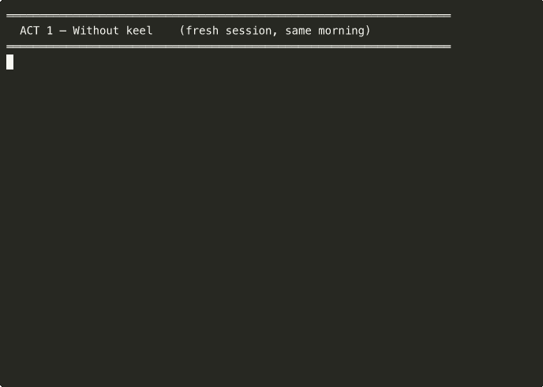

# keel-harness

**让你的 Claude Code 24 小时长 session 不漂、不失忆、不在测试上撒谎。**

[](https://github.com/mr-shaper/keel-harness/actions/workflows/tests.yml)
[](https://github.com/mr-shaper/keel-harness/releases)
[](LICENSE)
· [🇺🇸 English](README.md) · **🇨🇳 中文**

[5 分钟 Quickstart](#5-分钟-quickstart) · [4 层拓扑](#4-层嵌套并行拓扑) · [License](#license)



> **没装 keel：** 新 session、空白脑子。agent 忘了上 sprint 决策, 把已定的方案重新议一遍, 顺手把一段 API key 提交进 git, 然后告诉你"测试全过了" —— 你跑一遍, 6 个失败.
>
> **装了 keel：** 新 session、同一节奏。9 个 hook 在每次 tool call 上 fire, 7 字段 handoff 把上下文跨 session 接下来, secret 在 commit 时被拦, *"做完了"* 必须配 output evidence.

```bash
# 先装 superpowers + PUA 上游依赖 (见下面 必装上游依赖 段)，然后:
git clone https://github.com/mr-shaper/keel-harness && cd keel-harness && bash install.sh
```

一个 hook 框架 + handoff schema + audit gate. Apache-2.0, macOS + Linux. 基于 [superpowers](https://github.com/obra/superpowers) 和 [PUA](https://github.com/tanweai/pua).

---

## 30 秒电梯演讲

**Claude Code 写代码已经够了。但要让 agent 真正在 production 跑稳，光会写代码不够。**

你需要的是：
- 跨 session 接续不丢上下文（24h+ 长 session 不爆 context）
- 强制 AI 给真活体 evidence（不是嘴说"完成了"）
- 多 agent 并行不碰文件域（嵌套 P10/P9/P8/P7）
- 跨 session 律法不漂移（薄浇水律 + 7 字段 handoff schema）

`keel-harness` 把这些变成可 enforce 的 hooks，不是你自觉遵守。

---

## 它填补的 4 个缝隙

每个缝隙 = 现有 agent 工程的痛点。每个修法 = `keel-harness` 钦定一条工程律法。

| # | 缝隙 | 现状 | keel-harness 修法 |
|---|---|---|---|
| 1 | **AI memory loss across sessions** | session 重启 = AI 失忆，每次 prompt 重头讲背景 | **薄浇水律 + 7 字段 handoff schema** —— Stop hook 机械抽取 7 字段（sprint / next_action / blockers / decisions / files_changed / self_check / romeo_score），下 session SessionStart hook 强 Read 注入。0 AI 总结，0 漂移。 |
| 2 | **Paper-victory syndrome** | AI 说"完成了"但其实没跑命令 | **canonical 诚实律 + verification-before-completion** —— pre-commit hook 在 PreToolUse 层 BLOCK，要求每个 claim 配 evidence paste 真活体。 |
| 3 | **P9 role drift** | AI 自己下场写代码，本应该派 P8 sub-agent | **P10-9-8-7 嵌套并行拓扑 + 8 铁律** —— P9 不写代码，写 Task Prompt 派多 P8 同 message 真并行。文件域 grep verify 不重叠。违反 = 自动 PUA 3.5 罚分。 |
| 4 | **Vocabulary gap** | "agentic engineering" 是 Karpathy 提出但缺工程词汇 | **5 词进社区** —— Thin Watering Principle / 7-Field Handoff Schema / Romeo 6-Dim Audit / Canonical Honesty Rule / 4-Layer Nested Parallel。给 agent 工程师一套共享语言。 |

---

## 必装上游依赖（运行 install.sh 之前必装）

keel-harness 是 **kernel + workflow MD**。它的 workflow MD 引用的 runtime 协议在两个上游 OSS plugin 里。**没装这两个 keel-harness 不工作**。

`install.sh` Phase 0.5 会强检测，没装就 ABORT。

### 1. superpowers (MIT, by Jesse Vincent / @obra)

提供：`writing-plans`、`dispatching-parallel-agents`、`test-driven-development`、`verification-before-completion`、`brainstorming`、`executing-plans`、`subagent-driven-development`。

```bash
claude plugin marketplace add obra/superpowers-marketplace
claude plugin install superpowers@superpowers-marketplace
```

Repo: https://github.com/obra/superpowers · License: MIT · 测试版本: 5.0.7

### 2. PUA (MIT, by 探微安全实验室 / @tanweai)

提供：P10/P9/P8/P7 角色协议、红线 enforcement、Romeo evaluator、并行 agent 拓扑、压力升级。

```bash
git clone https://github.com/tanweai/pua ~/.claude/plugins/pua
```

Repo: https://github.com/tanweai/pua · License: MIT · 测试版本: 3.0.0

### Verify

```bash
ls ~/.claude/plugins/pua/plugin.json   # PUA 装好
ls -d ~/.claude/plugins/cache/superpowers-marketplace 2>/dev/null \
  || ls -d ~/.claude/plugins/marketplaces/superpowers-marketplace
```

任一缺失 → `bash install.sh` 直接 exit 2 + 打印安装命令。
仅 dogfood/dev 场景用 `--skip-deps-check` 跳过.

---

## 已捆绑 Plugin（install.sh 自动装）

下面这些跟 keel-harness ship 在一起 (`plugins/<name>/`)，install.sh Phase 1.5 自动 cp 到 `~/.claude/plugins/<name>/`。无需单独下载。

| Plugin | License | 提供 |
|---|---|---|
| **OODC** v1.4.0 | Apache-2.0 (by mr-shaper) | 认知循环：Observe → Orient → Decide → Create。4 个 reference 协议。被 `workflows/oodc-superpower-harness-orchestration.md` 引用 |

---

## 5 分钟 Quickstart

> **前置**：先装上面 Required Dependencies 段落的 superpowers + PUA。

```bash
curl -fsSL https://raw.githubusercontent.com/mr-shaper/keel-harness/main/install.sh | bash
```

手动 bootstrap（一行命令前的备选）：

```bash
# Step 1: clone kernel
git clone https://github.com/mr-shaper/keel-harness.git ~/.claude/plugins/keel-harness-mp

# Step 2: 应用 Layer 0 contract templates
cp ~/.claude/plugins/keel-harness-mp/templates/CLAUDE.md.global.template ~/.claude/CLAUDE.md
# 编辑 ~/.claude/CLAUDE.md — 填 <PLACEHOLDER> 字段

# Step 3: 合 hooks 进 settings.json (要 jq)
jq -s '.[0] * .[1]' \
  ~/.claude/settings.json \
  ~/.claude/plugins/keel-harness-mp/templates/settings.json.template \
  > /tmp/settings-merged.json && mv /tmp/settings-merged.json ~/.claude/settings.json
# 重启 Claude Code — harness hooks 激活
```

第一个 harness 化 session：

```
1. Read .harness/handoff-S<N-1>-to-S<N>.md   — 上 session 权威 next_action
2. 答 5 自检 (Q1 项目 / Q2 next_action / Q3 明确度 / Q4 handoff 名 / Q5 周次)
3. 干活 — Stop hook 自动写下 session handoff
```

---

## 4 层嵌套并行拓扑

```
═══════════════════════════════════════════════════════════════════
Harness (项目级，跨 8 周多 session)
   │
   └─ OODC (8 周 = 1 圈 OODC)
        │   O Observe (深度调研：7 源跨 GitHub/X/NLM/local)
        │   O Orient (假设检验 + 多视角大师会诊)
        │   D Decide (5 要素 + 决策点 + 用户审批门禁)
        │   C Create (RED-GREEN-REFACTOR + 8 项闭环 evidence)
        │
        └─ Superpower Pipeline 5 Phase
             │   Phase 0 启动
             │   Phase 1 探索（3 P8 真并行）
             │   Phase 2 决策收敛
             │   Phase 3 开发
             │   Phase 4 收尾
             │
     CEO（人类用户）—— 终极 authority，在所有 AI 角色之上
       │  钦定 / 越过 P10；每个战略决策的 final trump card
       ↓
             └─ PUA P10 / P9 / P8 / P7  （全是 AI 角色）
                  P10 = CTO（AI 战略层）—— 在 CEO 之下钦定，派 P9，不写代码
                  P9   = Tech Lead —— 写 Task Prompt，不写代码
                  P8   = Senior Eng —— 同 message 真并行，独占文件域
                  P7   = P8 派的 sub-agent —— 颗粒度细的 sub task
═══════════════════════════════════════════════════════════════════
```

### P9 8 铁律（不可违反）

1. P9 派多 P8 真并行（无依赖任务同 message 多 Agent 调用）
2. P8 内部 spawn P7，P9 不操心 sub-topology
3. P10 不写 Task Prompt，不管 P8（只跟 P9 对话）
4. **P9 绝不下场写代码** —— 写代码 = 角色错位 = 自动 PUA 3.5 跌破
5. **CEO（人类用户）永远 override P10** —— CEO 是人，P10 是 AI CTO；CEO 是整个 AI 层级之上的终极 authority
6. 文件域隔离 —— 派多 P8 前 grep verify 文件域不重叠
7. 同 message 多 Agent = 真并行（不是 loop sequential）
8. P9 跑 verify 命令 + paste 输出 —— 不空口

---

## 5 个想推进 agentic engineering 词汇库的词

| 词 | 含义 |
|---|---|
| **Thin Watering Principle** (薄浇水律) | 把 harness 约束作为 thin、universal 的层 —— 永远不耦合 enforcement 到私层个人 config。harness 应该任何人不改就能用。 |
| **7-Field Handoff Schema** (session 交接 7 字段) | minimum viable handoff: `sprint / next_action / blockers / decisions / files_changed / self_check / romeo_score`。任一缺 = 下 session 飞瞎。 |
| **Romeo 6-Dim Audit** (Romeo 6 维 audit) | 6 个独立维度 —— Honesty / Ownership / TechDepth / PatternReplay / Density / Candidates —— 每个 0-1.00 评分。整体 bar：avg ≥0.99 hardcore。不是 checklist，是 judgment framework。 |
| **Canonical Honesty Rule** (canonical 诚实律) | 每个 claim 必 evidence paste。"It works" 不配命令输出 = 0 分。hook 系统在 PreToolUse 层 enforce，AI 写完成报告之前。 |
| **4-Layer Nested Parallel** (4 层嵌套并行) | Harness ⊃ OODC ⊃ Superpower Phase 0-4 ⊃ PUA P10-9-8-7。每层并行。不只是"跑多 agent 并行" —— 结构化并行 + 角色分离 + 文件域隔离。 |

---

## License

Apache-2.0. 详见 [LICENSE](LICENSE)。

## Credits

- **superpowers** by Jesse Vincent (@obra) — MIT
- **PUA** by 探微安全实验室 (@tanweai) — MIT
- **OODC** by mr-shaper — Apache-2.0 (bundled in `plugins/oodc/`)
- 灵感来自 Karpathy 2026-02 "agentic engineering" 论述、Mitchell Hashimoto 工具命名风格、Boyd OODA loop

---

**完整 EN 文档**: [README.md](README.md)
